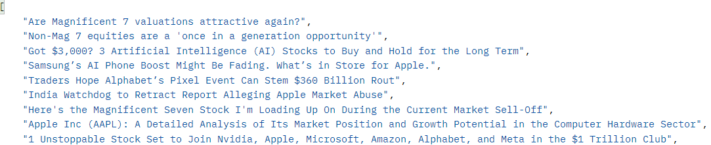

# Python-Flask---Stock-Info-And-Sentiment-API
Stock Info And Sentiment API is a Flask-based web server that provides an API to retrieve stock information, news headlines, and perform sentiment analysis on specified stock tickers. The server accepts HTTP requests and returns data in JSON format, making it suitable for integration with other applications or services.

## Features
* Get Stock Information: Retrieve detailed information about a specified stock ticker.
* Get News Headlines: Fetch the latest news headlines related to a specific stock ticker.
* Sentiment Analysis: Analyze the sentiment of news articles related to a stock ticker, returning an overall sentiment score and classification.

  

  <i>Headlines of news articles related to the stock</i>

 
 

  

  <i>Stock details</i>

 
 

  

  <i>Stock Sentiment Analysis</i>

## Technologies Used
* Python
* Flask
* BeautifulSoup
* NLTK (VADER Sentiment Analysis)

## Disclaimer
The data provided by this application is for educational and informational purposes only. The sentiment analysis and stock details are not guaranteed to be accurate. Do not use this data for actual financial trading or investment decisions. The creator of this project is not responsible for any financial losses or decisions made based on the information provided by this application.

## Contributing
Contributions are welcome! If you encounter any issues or have suggestions for improvements, please open an issue or submit a pull request.
 
I can also be contacted at sahyogshetty12@gmail.com
